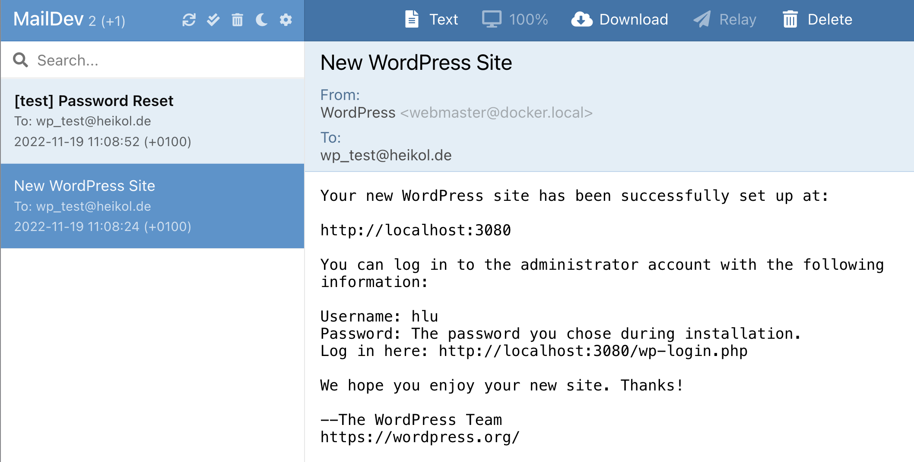
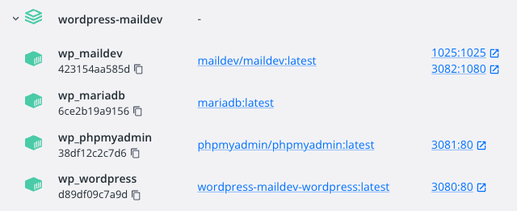

# WordPress with Email

This is a docker stack for testing WordPress including the ability to check mails. You can check the mails from wordpress with [MailDev](https://github.com/maildev/maildev), an smtp server with web interface. [msmtp](https://marlam.de/msmtp/) is used as simple SMPT client. 



Running the docker compose command creates four containers:
  * wp_wordpress – WordPress CMS
    * http://localhost:3080 – WordPress instance, ready for installation
    * WordPress files are available mapped to docker host in directory 'wp'
  * wp_mariadb – MariaDB database
    * database available as mysql:3306
    * user 'root', password 'root' and database 'wordpress'
  * wp_phpmyadmin – phpmyadmin database administration app
    * http://localhost:3081 – phpMyAdmin to work with the database
  * wp_maildev - MailDev for collecting and displaying emails
    * listening on emails as maildev:1025
    * http://localhost:3082 – MailDev web interface

```
$ git clone https://github.com/muhme/wordpress-maildev
$ cd wordpress-maildev
$ docker compose up -d
```

All four containers are used in the latest version.



## Testing
You can test mails from Wordpress after the initial installation using the "Forgot your password?" feature at http://localhost:3080/wp-login.php.

You can test the used https://marlam.de/msmtp with:
```
host $ docker exec -it wp_wordpress /bin/bash
container # echo -e "Subject: Test Mail\r\nTo: you@test.com\r\n\r\nEverything working?" | msmtp --debug -f me@test.com -- you@test.com
```

You can test PHP email configuration with:
```
host $ docker exec -it wp_wordpress /bin/bash
container # php -r "mail('you@test.com','Test Mail from PHP', 'Working too?', 'From: me@test.com');"
```

## License
This project is licensed under the MIT License.

## Contact
Don't hesitate to ask if you have any questions or comments.
